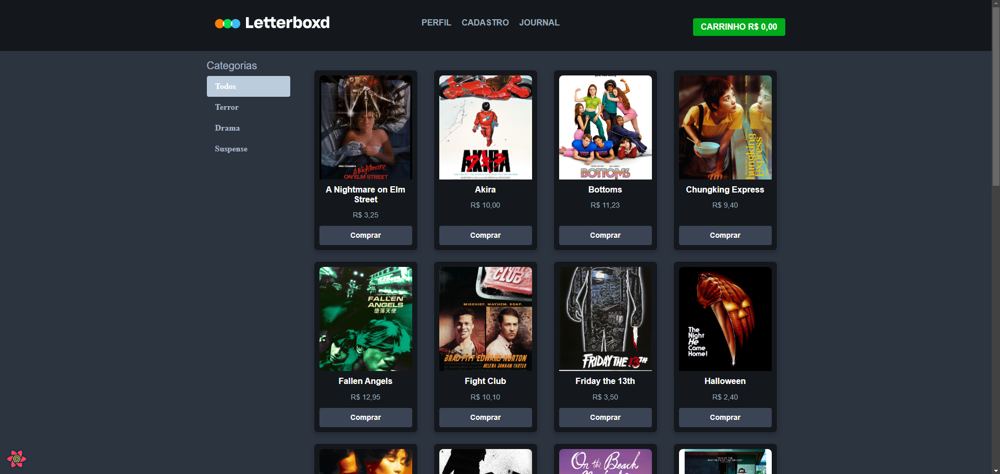
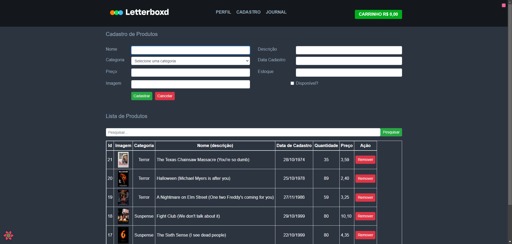
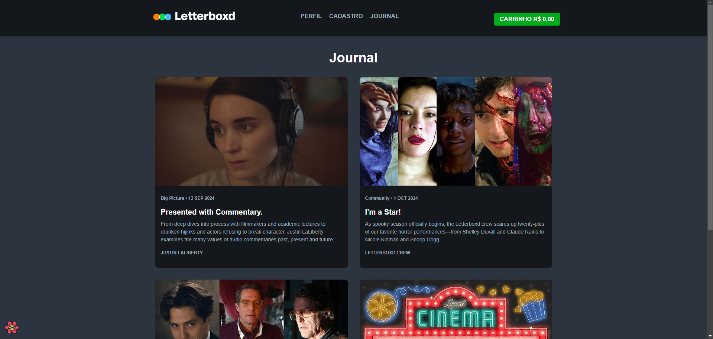
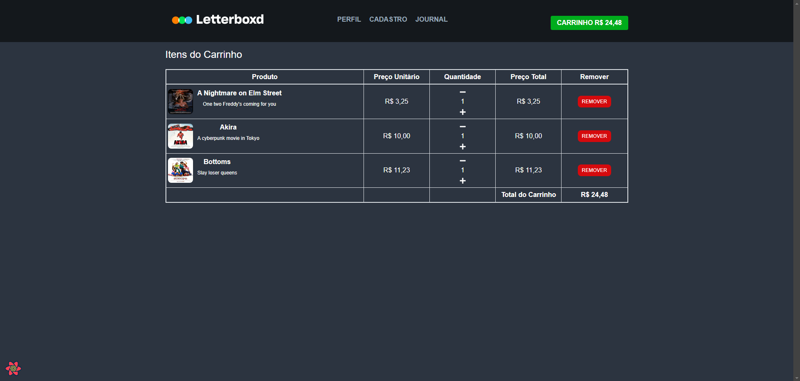

# **Letterboxd React - Loja com Carrinho de Compras**


Este projeto é uma aplicação web inspirada no **Letterboxd**, adicionando a funcionalidade de **carrinho de compras**. A aplicação possui um **front-end em React com Vite**, um **back-end em Spring Boot** e utiliza **MySQL** para gerenciamento de dados.

---

## **📄 Descrição do Projeto**
O projeto **Letterboxd React** foi desenvolvido para:
- Exibir uma lista de produtos (filmes) categorizados.
- Permitir a adição, remoção e manipulação de itens no carrinho de compras.
- Integrar um **front-end moderno (React)** com uma **API RESTful** desenvolvida em **Spring Boot**.

---

## **🖼 Imagens do Sistema**

### Tela Inicial - Listagem de Filmes


### Exibição dos Detalhes do Produto


### Carrinho de Compras


### API Back-End em Execução


---

## **📂 Estrutura do Projeto**

### **Back-End**
- **Tecnologia:** Spring Boot (Java 17+)
- **Banco de Dados:** MySQL
- **Funcionalidades Principais:**
  - CRUD completo de produtos, categorias e carrinho.
  - Manipulação de itens no carrinho com persistência.
  - API paginada com suporte a buscas.

### **Front-End**
- **Tecnologia:** React com Vite
- **Bibliotecas:** Axios, React Router
- **Funcionalidades Principais:**
  - Interface responsiva para listagem e gerenciamento de produtos.
  - Integração com a API RESTful.
  - Gerenciamento de estado do carrinho de compras.

---

## **🚀 Tecnologias Utilizadas**

### **Back-End**
- Java 17+
- Spring Boot
- Hibernate (JPA)
- MySQL

### **Front-End**
- React
- Vite
- Axios
- React Router

### **Ferramentas**
- IntelliJ IDEA / Eclipse
- MySQL Workbench
- Postman

---

## **🛠️ Instalação e Execução**

### **Pré-requisitos**
- **Node.js 16+** e **npm** instalados.
- **JDK 17+** instalado e configurado.
- **MySQL** instalado e configurado.

---

### **1. Clone o Repositório**

```bash
git clone https://github.com/vitoriaguidines/letterboxd-react.git
cd letterboxd-react
```

---

### **2. Configuração do Back-End**

1. Acesse o diretório `src/main/resources` e edite o arquivo `application.properties` com as credenciais do MySQL:

   ```properties
   spring.datasource.url=jdbc:mysql://localhost:3306/letterboxd
   spring.datasource.username=seu_usuario
   spring.datasource.password=sua_senha
   spring.jpa.hibernate.ddl-auto=update
   ```

2. Compile e execute o servidor usando Maven:
   ```bash
   mvn clean install
   mvn spring-boot:run
   ```

3. O servidor iniciará na porta padrão:
   ```
   http://localhost:8080
   ```

---

### **3. Configuração do Front-End**

1. Acesse o diretório do front-end e instale as dependências:
   ```bash
   cd front-end
   npm install
   ```

2. Inicie o servidor de desenvolvimento:
   ```bash
   npm run dev
   ```

3. O front-end será executado na seguinte URL:
   ```
   http://localhost:5173
   ```

---

## **📦 Testando a Aplicação**

### **Back-End**
- Utilize ferramentas como **Postman** ou **Insomnia** para testar os endpoints da API:
  - `GET /produtos`
  - `POST /carrinhos/criar`

### **Front-End**
- Acesse a aplicação na URL `http://localhost:5173` e realize os seguintes testes:
  - Adicione produtos ao carrinho.
  - Remova produtos.
  - Verifique o total atualizado.

---

## **🧩 Estrutura de Endpoints Principais**

### **Produtos**
- `GET /produtos` - Lista todos os produtos.
- `POST /produtos` - Adiciona um novo produto.
- `PUT /produtos/{id}` - Atualiza um produto.
- `DELETE /produtos/{id}` - Remove um produto.

### **Carrinhos**
- `POST /carrinhos/criar` - Cria um novo carrinho.
- `POST /carrinhos/adicionar` - Adiciona itens ao carrinho.
- `DELETE /carrinhos/remover/{id}` - Remove um item do carrinho.

---

## **📚 Documentação Adicional**
- **Swagger:** Documentação da API (se configurado).
- **Coleção do Postman:** Disponível no diretório `/postman`.

---

## **📝 Licença**

Este projeto está licenciado sob a **MIT License**. Veja o arquivo [LICENSE](LICENSE) para mais detalhes.

---

## **💻 Desenvolvedora**

- **Vitória Guidines**  
  [GitHub](https://github.com/vitoriaguidines) | [LinkedIn](https://linkedin.com)

Se você gostou do projeto, deixe uma ⭐ no repositório!

---

